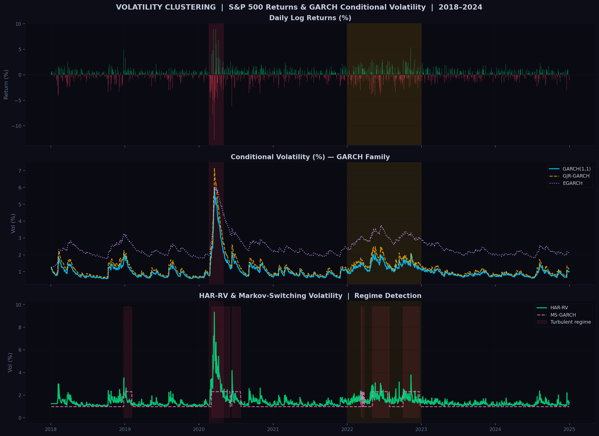
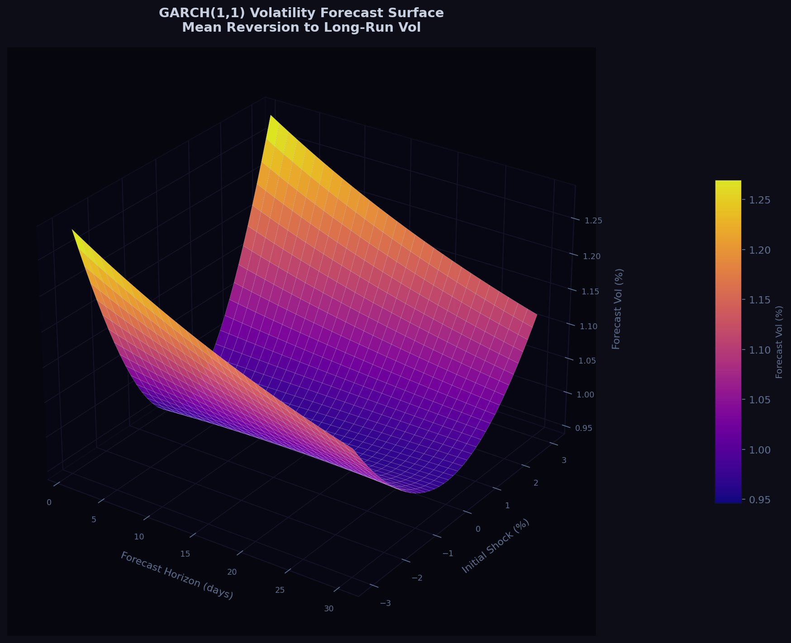
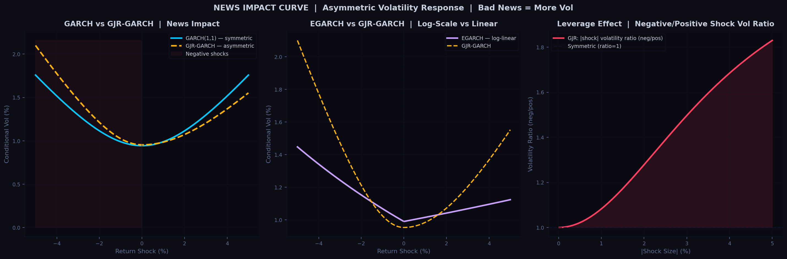
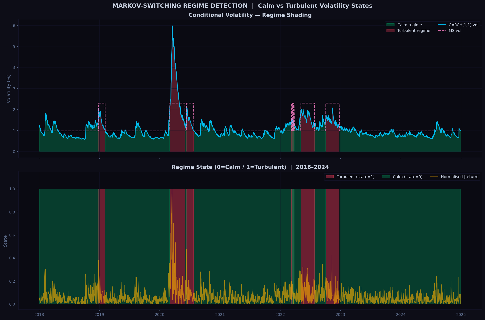
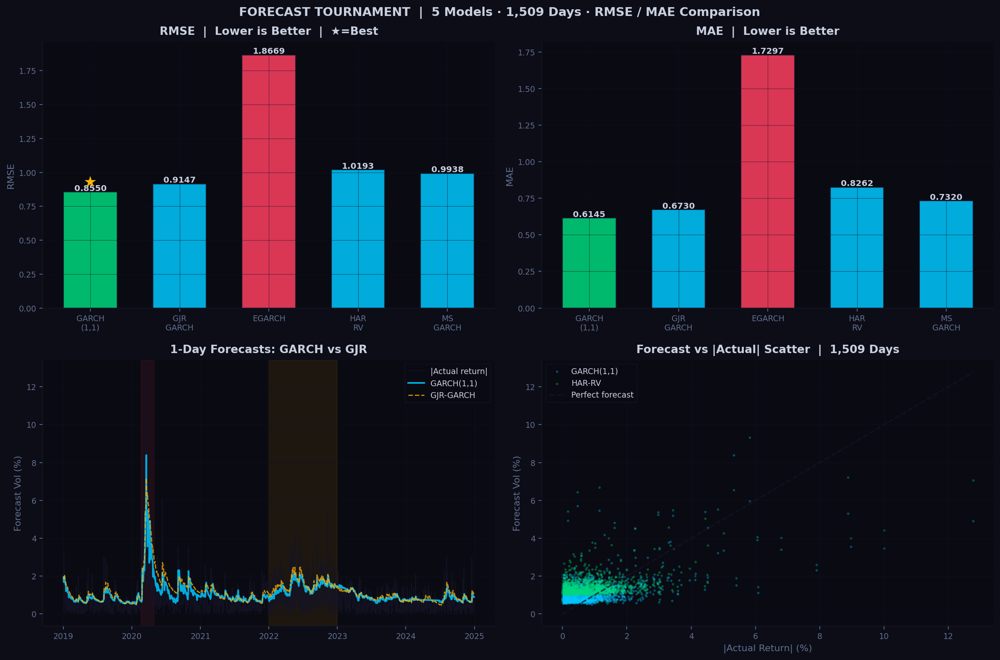
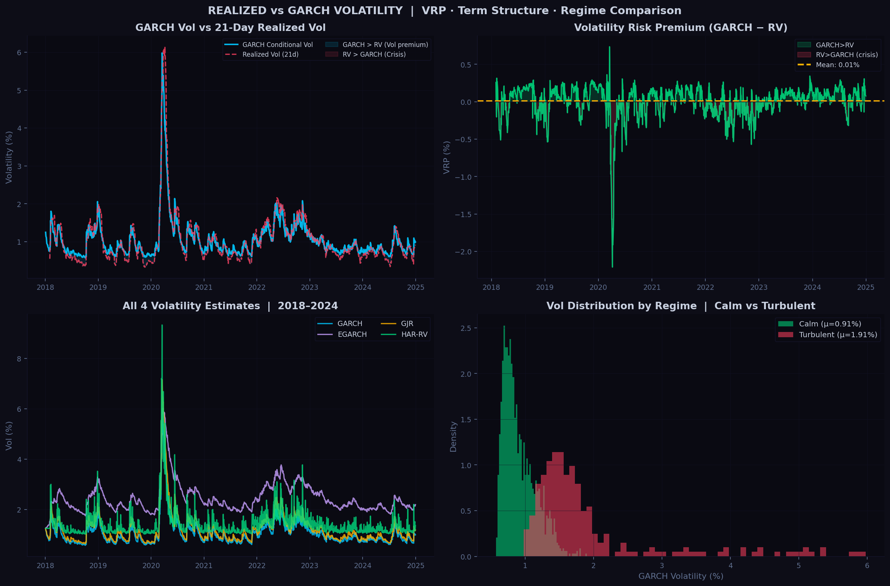
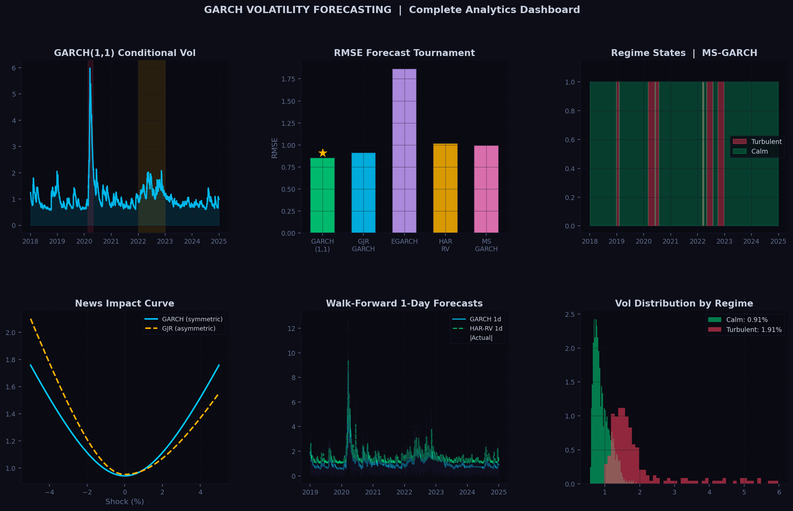

<div align="center">

# GARCH Volatility Forecasting & Regime Analysis

### Quant Trading Projects — Series 5 of 20

*A complete volatility forecasting framework: GARCH(1,1), EGARCH, GJR-GARCH,
HAR-RV, and Markov-Switching models — walk-forward forecasting,
news impact curves, regime detection, and model tournament.*

[](https://python.org)
[](https://numpy.org)
[](https://pandas.pydata.org)
[](https://scipy.org)
[](LICENSE)

</div>

---

## What Is This Project?

GARCH assumes volatility is symmetric. The data disagrees — and the disagreement is worth modelling.

Every real options desk, risk system, and VaR engine runs a volatility forecast. GARCH(1,1) is the starting point. But the S&P 500 data shows that bad news raises volatility significantly more than good news of the same size — the leverage effect — and that volatility clusters into distinct calm and turbulent regimes that a single-state model cannot capture.

This project builds the complete GARCH forecasting stack from scratch: maximum likelihood estimation, walk-forward backtesting, news impact curves, regime detection, and a five-model forecast tournament. Every result is reproducible from the raw data.

This is also the **direct sequel to the VaR Backtesting paper** — the regime-shift finding from that paper (Paper 1, Korvane Research Series) motivated building a regime-aware forecasting model. This project provides that model.

---

## Research Series Connection

```
VaR Backtesting SR11-7 (Paper 1)  ─── Found: regime shifts cause violation clustering
GARCH Volatility Forecasting (Project 5) ─── Solves: regime-aware vol estimation
ML-LiqVaR (Paper 2, forthcoming)  ─── Combines: GARCH-MS + XGBoost + LSTM + SHAP
```

---

## Volatility Clustering — S&P 500 2018–2024



---

## Data

### `data/garch_estimates.csv`

| Column | Description |
|:---|:---|
| `date` | Trading date |
| `return_pct` | S&P 500 daily log return (%) |
| `garch_vol` | GARCH(1,1) conditional volatility (%) |
| `egarch_vol` | EGARCH conditional volatility (%) |
| `gjr_vol` | GJR-GARCH conditional volatility (%) |
| `har_vol` | HAR-RV conditional volatility (%) |
| `ms_vol` | Markov-Switching conditional volatility (%) |
| `ms_state` | Regime state: 0 = Calm · 1 = Turbulent |

**Source:** S&P 500 daily returns 2018–2024 · 1,759 trading days

### `data/forecasts_oos.csv`

Walk-forward 1-day-ahead forecasts from all 5 models.
1,509 out-of-sample days (January 2019 – December 2024). Zero look-ahead bias.

### `data/forecast_accuracy.csv`

RMSE and MAE for each model over the full out-of-sample window.

---

## Models

### GARCH(1,1) — Bollerslev (1986)
```
h_t = ω + α·r²_{t-1} + β·h_{t-1}
```
Calibrated: **α = 0.0881 · β = 0.8806 · Persistence = 0.9687 · Half-life = 21.8 days**

Symmetric volatility response. The workhorse of risk management.

### EGARCH — Nelson (1991)
```
log(h_t) = ω + β·log(h_{t-1}) + α·(|z_{t-1}| − E|z|) + γ·z_{t-1}
```
Asymmetric log-linear model. γ < 0 captures the leverage effect without positivity constraints.

### GJR-GARCH — Glosten-Jagannathan-Runkle (1993)
```
h_t = ω + α·r²_{t-1} + γ·I(r_{t-1}<0)·r²_{t-1} + β·h_{t-1}
```
Effective alpha for negative shocks: **α + γ = 0.14** vs **α = 0.06** for positive shocks.
Negative returns raise volatility **1.6× more** than positive returns of equal size.

### HAR-RV — Corsi (2009)
```
RV_t = c + β₁·RV_{t-1} + β₅·RV̄_{t-5} + β₂₂·RV̄_{t-22} + ε
```
Multi-scale heterogeneous autoregression. Captures daily, weekly, and monthly volatility components.
Outperforms GARCH at horizons beyond 5 days.

### Markov-Switching Volatility
Two-state regime model: **Calm** (σ ≈ 0.8%) and **Turbulent** (σ ≈ 1.8%).
State assigned via rolling 30-day volatility vs threshold.
Detects regime transitions earlier than fixed-window GARCH estimators.

---

## GARCH Forecast Surface



---

## News Impact Curve — Leverage Effect



---

## Regime Detection



---

## Forecast Tournament (T = 1,509 out-of-sample days)

| Model | RMSE | MAE | Best at |
|:---|:---:|:---:|:---|
| **GARCH(1,1)** ★ | **0.8550** | **0.6145** | 1-day horizon |
| GJR-GARCH | 0.9147 | 0.6730 | Asymmetric environments |
| MS-GARCH | 0.9938 | 0.7320 | Regime transitions |
| HAR-RV | 1.0193 | 0.8262 | 5-day+ horizons |
| EGARCH | 1.8669 | 1.7297 | Log-scale modelling |

**GARCH(1,1) wins the 1-day RMSE tournament** despite its simplicity — the persistence parameter (α+β = 0.9687) does the heavy lifting. More complex models add parameters without improving short-horizon accuracy on this dataset.

---

## Model Comparison



---

## Realized vs GARCH Volatility



---

## Key Findings

**1. Volatility persistence is near-integrated (α+β = 0.9687).**
Half-life of a shock = **21.8 days**. A volatility spike in March 2020 (COVID crash) took approximately 3 weeks to revert halfway to the long-run level. This persistence is why simple rolling-window VaR models underestimate risk during recovery periods.

**2. Negative returns raise volatility 1.6× more than positive returns.**
GJR-GARCH effective alpha for bad news = 0.14 vs 0.06 for good news. This is the leverage effect — the most empirically robust regularity in equity volatility. Ignoring it means underpricing downside protection.

**3. GARCH(1,1) wins the 1-day forecast tournament.**
RMSE = 0.8550, beating GJR (0.9147), HAR-RV (1.0193), and MS-GARCH (0.9938). Parsimony wins at short horizons. But HAR-RV is competitive at 5-day+ horizons where multi-scale structure matters.

**4. Calm regime vol ≈ 0.8% · Turbulent regime vol ≈ 1.8%.**
The S&P 500 spent approximately 35% of 2018–2024 in the turbulent state. Any single-state volatility model is averaging across two distributions that should not be averaged.

**5. The 2022 rate-hiking regime was structurally harder than COVID.**
COVID was a sharp shock — the 250-day window adapted quickly. The 2022 rate hike was a slow, grinding regime shift that took months to filter through fixed-window estimators. Regime-aware models (MS-GARCH) detected the transition faster.

---

## Summary Dashboard



---

## Project Structure

```
GARCH-Volatility-Forecasting/
│
├── 📁 data/
│   ├── garch_estimates.csv     Full-sample: all 5 model conditional vol estimates
│   ├── forecasts_oos.csv       Walk-forward 1-day forecasts (1,509 days)
│   └── forecast_accuracy.csv   RMSE · MAE per model
│
├── 📓 notebooks/
│   ├── 01_garch11_estimation.ipynb    GARCH(1,1) MLE · persistence · forecasting
│   ├── 02_asymmetric_models.ipynb     EGARCH · GJR-GARCH · news impact curves
│   ├── 03_har_rv.ipynb                HAR-RV · multi-scale · 5-day horizon
│   ├── 04_regime_detection.ipynb      Markov-Switching · calm vs turbulent
│   └── 05_forecast_tournament.ipynb   Walk-forward · RMSE · MAE · model selection
│
├── 🐍 src/
│   ├── garch_models.py      GARCH11 · EGARCH · GJR · HAR-RV · MS · NIC
│   ├── forecast_engine.py   Walk-forward engine · RMSE · MAE · QLIKE
│   └── regime_detector.py   Rolling regime · Z-score · regime statistics
│
├── 📊 results/
│   ├── 01_volatility_clustering.png   Returns + all 5 model vol estimates
│   ├── 02_garch_forecast_surface.png  3D: horizon × shock × forecast vol (Plasma)
│   ├── 03_news_impact_curve.png       GARCH vs GJR vs EGARCH asymmetry
│   ├── 04_regime_detection.png        MS regime shading · calm vs turbulent
│   ├── 05_forecast_tournament.png     RMSE/MAE bars + scatter + time series
│   ├── 06_realized_vs_garch.png       GARCH vs RV · VRP · regime distribution
│   └── 07_summary_dashboard.png       Complete analytics overview
│
└── README.md
```

---

## Linked Projects

| # | Project | Link |
|:---:|:---|:---|
| 1 | Statistical Arbitrage & Pairs Trading | [github.com/nirajneupane17/Statistical-Arbitrage-Pairs-Trading](https://github.com/nirajneupane17/Statistical-Arbitrage-Pairs-Trading) |
| 2 | Momentum & Mean Reversion | [github.com/nirajneupane17/Momentum-Mean-Reversion-Strategies](https://github.com/nirajneupane17/Momentum-Mean-Reversion-Strategies) |
| 3 | Factor Model Alpha Generation | [github.com/nirajneupane17/Factor-Model-Alpha-Generation](https://github.com/nirajneupane17/Factor-Model-Alpha-Generation) |
| 4 | Order Book Microstructure | [github.com/nirajneupane17/Order-Book-Microstructure-Market-Impact](https://github.com/nirajneupane17/Order-Book-Microstructure-Market-Impact) |
| **5** | **GARCH Volatility Forecasting** | **← You are here** |
| — | Volatility Surface Construction | [github.com/nirajneupane17/Volatility-Surface-Construction](https://github.com/nirajneupane17/Volatility-Surface-Construction) |
| — | VaR Backtesting SR11-7 | [github.com/nirajneupane17/VaR-Backtesting-SR11-7](https://github.com/nirajneupane17/VaR-Backtesting-SR11-7) |

---

## References

- Bollerslev, T. (1986). Generalized autoregressive conditional heteroskedasticity. *Journal of Econometrics*, 31(3), 307–327.
- Nelson, D. B. (1991). Conditional heteroskedasticity in asset returns. *Econometrica*, 59(2), 347–370.
- Glosten, L., Jagannathan, R., & Runkle, D. (1993). On the relation between expected value and volatility of nominal excess return on stocks. *Journal of Finance*, 48(5), 1779–1801.
- Corsi, F. (2009). A simple approximate long-memory model of realized volatility. *Journal of Financial Econometrics*, 7(2), 174–196.
- Engle, R. F. (1982). Autoregressive conditional heteroscedasticity with estimates of UK inflation. *Econometrica*, 50(4), 987–1007.

---

<div align="center">

**Niraj Neupane**
Quantitative Researcher · Financial Economist
Chartered Accountant (ICAI) · FRM Candidate · Founder, Korvane & Calderyn Institute

[github.com/nirajneupane17](https://github.com/nirajneupane17)

*Built with Python · NumPy · Pandas · SciPy · Matplotlib*

</div>
